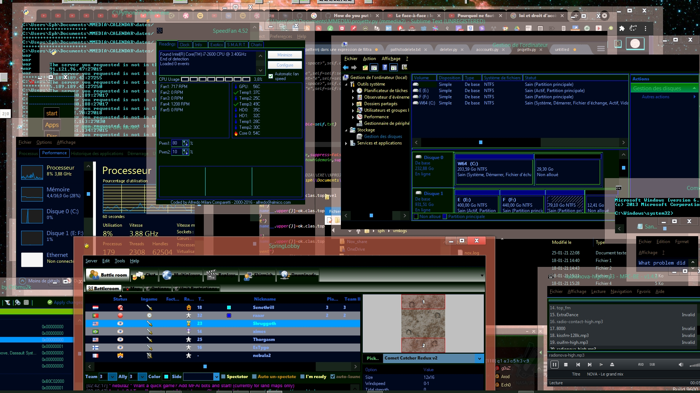

# Win8ThemeNoBoom
---
```xml
A full dark colored Windows 8 theme
```
___

Unreleased, the file sied is inconsistant, the export function seems to be a little not aware of all paths in the system, applications and registry.

This theme required a lot of tools to make it, applications for tune and add to keys regedit, several softwares could be additionnaly needed to continue the enhancements, like very large border completly transparent and colored, i do not recommand to add delay in the theme change, the effect is very beautiful, fast and eat not much CPU, but it can add a very low latency gradually, this happened to me , the computer will take much more time to wake up and synchronize screen with all the windows, they are like inaccessible, the latency of the screen will be multiplied greatly, it's like incremental operations silently, so even with best software and hardawre ,this isn't possible.
[](https://github.com/acccounttest/Win8ThemeNoBoom)


Normally there is a sound that happend on multiple events, this is not the one you can see in configuration, line is empty in the .theme file.

You will need to install sounds manually in the same name of the folder found in the configuration file, the installation of all the other features is next.



